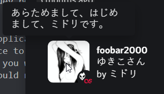

## listening-to
a program that displays your current status on last.fm to the world on discord


### installation
to install from source:
1. clone and cd into this github repository with
    ```bash
    git clone https://github.com/0i8/listening-to/ && cd listening-to
    ```
    or, download the tarball and extract it
    
2a. go to the [discord dev portal](https://discord.com/developers/) and create a new application, you will replace client_id in config.json with your application id
 
2b. name this application whatever you want your status to look like, for example: if you want it to display "Playing music", you would name the application "music".

3. find your discord user token, google how to do it. you will replace discord_token in config.json with your token

    > be warned as this is in a grey area of the discord tos, and as such; i am not liable for any action taken against your account for the usage of this program.

3. go to the [last.fm api page](https://www.last.fm/api) and register for an account. you will replace lastfm_api_key in config.json with your api key after registering.
4. finally, replace lastfm_name with your last.fm username in config.json
5. install any pip packages that you are missing with
    ```bash
    python3.9 -m pip install -r requirements.txt
    ```
### usage
to run, simply execute
```
python3.9 main.py
```
in whatever directory you cloned into

if you see "starting listening-to", and it starts to display "caching" messages and a ton of green; you've successfully ran the program. your status should be changed on discord.

if your status changes but you cannot see your album cover, check to see if you hit the asset limit for your application. if not, just wait a bit. it will take a minute to cache.

if you have any problems caching stuff (status will not change on discord but last.fm reports a change), then try editing replace.json with some of the characters that may be of issue. this shouldn't be a problem, but i'll leave it here just in case.

another issue i've seen is people with 2fa who log out/log in frequently may see this program break due to their token changing, if this happens to you: just change your token in config.json with your current one.

### credits
base by null, null#3330

expanded by jupiter

thanks to qwertyquerty for [pypresence](https://github.com/qwertyquerty/pypresence)
